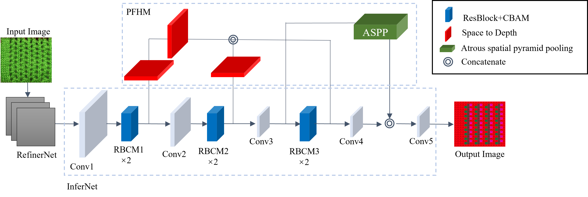

# LFSCG-E-Net-

Enhancing Low-Frequency Stitch Code Generation for Knitted Fabrics
This repository contains code for the paper **"Enhancing Low-Frequency Stitch Code Generation for Knitted
Fabrics: An LFSCG-E-Net Approach". ** 
# Dependencies
Several scripts assume a Linux environment with Bash, though it may work on MacOS and/or Windows with CigWIN (but was not tested there).

In general, you need python 3, with several dependencies that can easily be installed with `pip`:

```
pip install -r requirements.txt
```


## Downloading model
For the our network, you can use (https://download.csdn.net/download/qq_41936215/89985551?ydreferer=aHR0cHM6Ly9tcC5jc2RuLm5ldC9tcF9kb3dubG9hZC9tYW5hZ2UvZG93bmxvYWQvVXBEZXRhaWxlZA%3D%3D).

For the refiner network, you will need to download vgg16 in the vgg model directory.

```
# download vgg16.npy and vgg19.npy
cd model/tensorflow_vgg/
./download.sh
```


### Dataset

The Knitting Patterns dataset used in this experiment comes from Kasper et al(https://deepknitting.csail.mit.edu/dataset/dataset.zip)
```
./dataset.sh
```

## Execute
Execute execute.sh can realize the conversion of image to stitch code

```
./execute.sh -g 0 -c checkpoint/lfscg-e-net test_real/*.jpg
```


## Testing
You can test our modeling results

```
python test/eval_result.py lfscg-e-net
```
